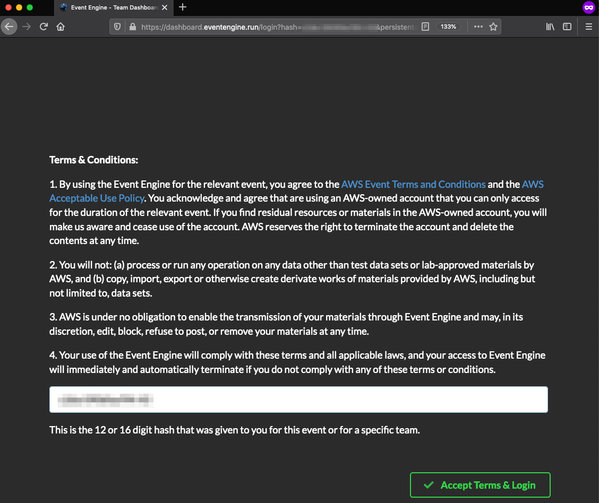
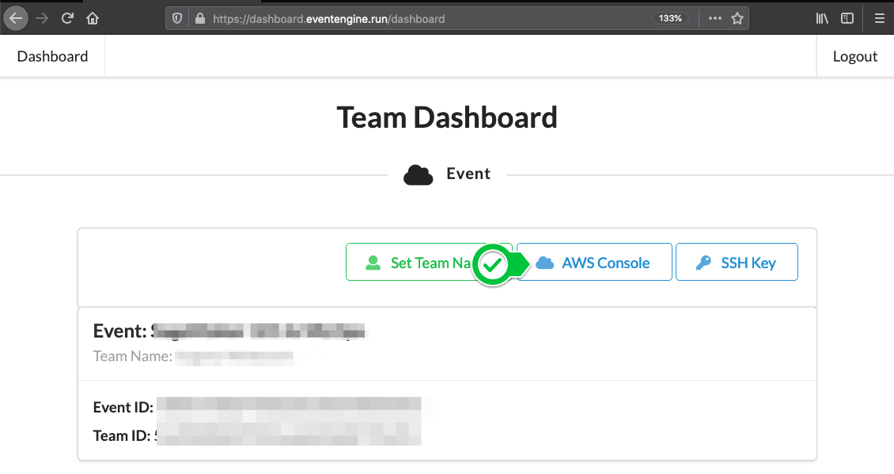
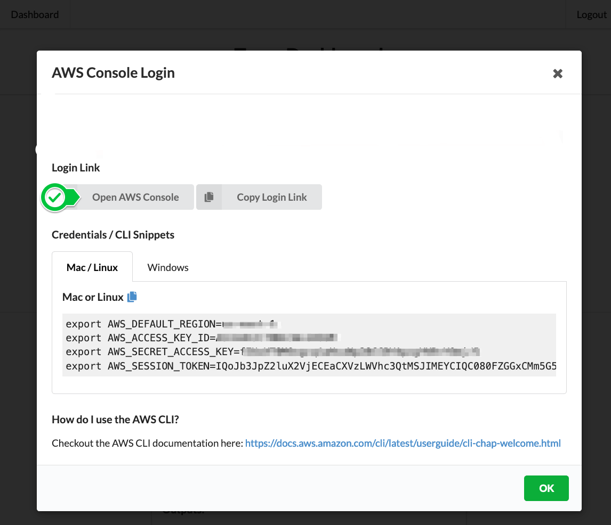

#  Get Started with AWS Web Console

You have been provisioned a temporary dedicated AWS account for the purposes of today's workshop. 
You will have been sent your access details beforehand - A 12-character code (or ‘hash’) that grants you the access to the AWS environment.

## 1. Login to the Event Engine 

-  Go to https://dashboard.eventengine.run/, enter the access code and click Proceed: 

- Click on AWS Console, then Open AWS Console to login into your dedicated AWS environment.

